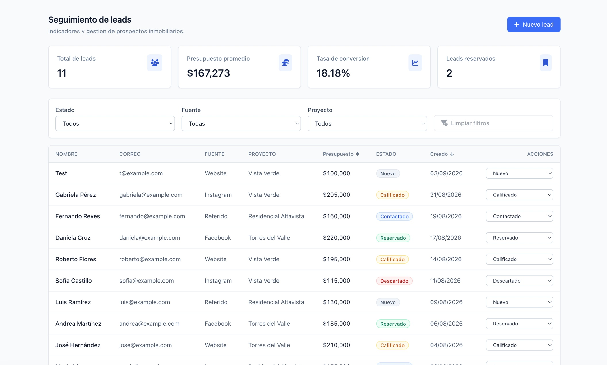
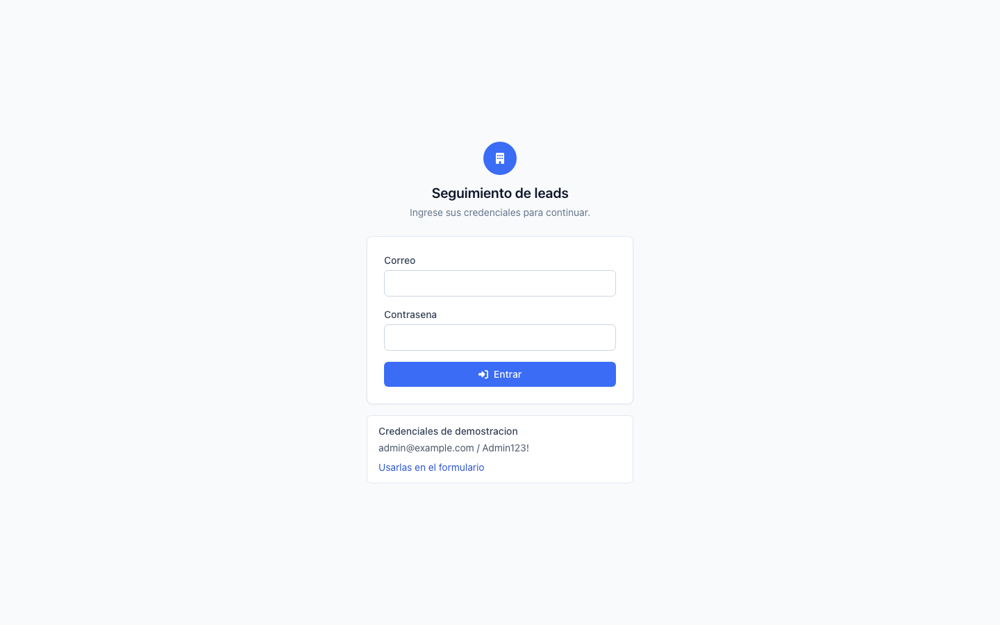
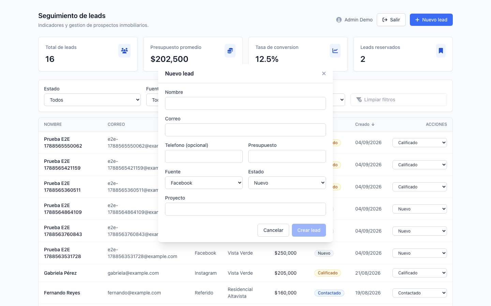

<div align="center">

# Real Estate Lead Management

Módulo de seguimiento de leads inmobiliarios: listado con filtros y paginación,
cambio de estado, alta de leads y un dashboard de métricas resuelto en una sola
consulta de agregación.

[](https://github.com/GerardoAmaya/real-estate-lead-management/actions/workflows/ci.yml)
[](https://sonarcloud.io/summary/new_code?id=GerardoAmaya_real-estate-lead-management)
[](https://sonarcloud.io/summary/new_code?id=GerardoAmaya_real-estate-lead-management)
[](https://sonarcloud.io/summary/new_code?id=GerardoAmaya_real-estate-lead-management)




|                       Acceso                       |                      Alta de lead                       |
| :------------------------------------------------: | :-----------------------------------------------------: |
|  |  |

</div>

El análisis escrito que acompaña a la prueba (modelo de datos, diagnóstico de
incidente, arquitectura en AWS, plan de migración y seguridad) está en
[TECHNICAL_ANALYSIS.md](./TECHNICAL_ANALYSIS.md).

## Contenido

1. [Requisitos](#requisitos)
2. [Puesta en marcha](#puesta-en-marcha)
3. [Ejecución con Docker](#ejecución-con-docker)
4. [Variables de entorno](#variables-de-entorno)
5. [API](#api)
6. [Estructura del proyecto](#estructura-del-proyecto)
7. [Decisiones técnicas](#decisiones-técnicas)
8. [Cómo crecería el módulo](#cómo-crecería-el-módulo)
9. [Pruebas](#pruebas)
10. [Calidad y CI](#calidad-y-ci)
11. [Seguridad](#seguridad)
12. [Limitaciones conocidas](#limitaciones-conocidas)
13. [Uso de inteligencia artificial](#uso-de-inteligencia-artificial)
14. [Autor](#autor)

## Requisitos

| Herramienta | Versión       | Nota                                          |
| ----------- | ------------- | --------------------------------------------- |
| Node.js     | 20.19.0       | Fijada en `.nvmrc`. Con `nvm` basta `nvm use` |
| npm         | 10 o superior | Viene con Node 20                             |
| Docker      | 24 o superior | Solo para MongoDB, o para el stack completo   |

No hace falta instalar MongoDB en la máquina: el `docker-compose.yml` levanta
la instancia, y las pruebas usan una base en memoria.

## Puesta en marcha

Desde la raíz del repositorio:

```bash
nvm use                # Node 20 (ver .nvmrc)
cp .env.example .env   # valores por defecto listos para desarrollo
npm install            # instala raíz, backend y frontend
npm run db:up          # MongoDB 7 en Docker, puerto 27017
npm run migrate:up     # colecciones, índices y validators
npm run seed           # carga los 10 leads del Anexo A y el usuario admin
npm run dev            # API en :3000 y Angular en :4200
```

Al terminar:

| Servicio              | URL                              |
| --------------------- | -------------------------------- |
| Aplicación Angular    | http://localhost:4200            |
| API                   | http://localhost:3000/api        |
| Documentación Swagger | http://localhost:3000/api/docs   |
| Health check          | http://localhost:3000/api/health |

Credenciales del usuario que crea el seed, tomadas de `SEED_ADMIN_EMAIL` y
`SEED_ADMIN_PASSWORD`:

```
admin@example.com / Admin123!
```

La aplicación pide sesión al entrar: la ruta `/leads` está protegida por un
guard y sin sesión se redirige a `/login`, conservando el destino para volver a
él después. La pantalla de acceso muestra estas credenciales y tiene un botón
que las carga en el formulario, así que no hace falta copiarlas.

### Comandos disponibles

| Comando                  | Qué hace                                                        |
| ------------------------ | --------------------------------------------------------------- |
| `npm run dev`            | Levanta API y SPA en paralelo con recarga                       |
| `npm run build`          | Compila backend a `backend/dist/` y frontend a `frontend/dist/` |
| `npm test`               | Pruebas de backend y frontend                                   |
| `npm run test:cov`       | Lo mismo con reporte de cobertura                               |
| `npm run lint`           | ESLint en ambos paquetes, sin tolerar warnings                  |
| `npm run typecheck`      | Verificación de tipos sin emitir                                |
| `npm run migrate:status` | Estado de las migraciones aplicadas                             |
| `npm run seed:fresh`     | Recarga el seed borrando lo anterior                            |
| `npm run db:reset`       | Borra el volumen de Mongo y vuelve a levantarlo                 |

## Ejecución con Docker

El stack completo, sin necesidad de Node ni de instalar dependencias:

```bash
cp .env.example .env
docker compose --profile full up --build -d
```

Con Node instalado, el atajo equivalente es `npm run docker:up`.

El arranque respeta un orden explícito: Mongo levanta y pasa su healthcheck, un
contenedor de un solo disparo aplica migraciones y seed y termina, la API sólo
arranca cuando ese contenedor salió con código 0, y nginx espera a que la API
esté sana.

| Servicio   | URL                            |
| ---------- | ------------------------------ |
| Aplicación | http://localhost:8080          |
| API        | http://localhost:3000/api      |
| Swagger    | http://localhost:3000/api/docs |

Si alguno de esos puertos ya está ocupado en su máquina, cámbielo en el `.env`
con `WEB_PORT`, `API_PORT` o `MONGO_PORT` y vuelva a levantar: el compose los lee
de ahí y ajusta también el origen permitido por CORS.

En este modo nginx sirve la SPA y hace de proxy de `/api` hacia el contenedor de
la API, así que el navegador ve un solo origen y no interviene CORS. Para seguir
los logs, `npm run docker:logs`; para bajar todo, `npm run docker:down`, o
`npm run docker:reset` si además quiere borrar los datos.

## Variables de entorno

Un único `.env` en la raíz alimenta al backend en desarrollo y a los
contenedores vía `env_file`. `.env.example` está versionado con valores que
funcionan tal cual; el `.env` real nunca se versiona.

| Variable                     | Por defecto                                   | Para qué sirve                                             |
| ---------------------------- | --------------------------------------------- | ---------------------------------------------------------- |
| `NODE_ENV`                   | `development`                                 | Modo de ejecución                                          |
| `PORT`                       | `3000`                                        | Puerto de la API                                           |
| `MONGODB_URI`                | `mongodb://localhost:27017/real_estate_leads` | Cadena de conexión                                         |
| `MONGODB_DB_NAME`            | `real_estate_leads`                           | Nombre de la base                                          |
| `MONGO_PORT`                 | `27017`                                       | Puerto publicado por el contenedor de Mongo                |
| `API_PORT`                   | `3000`                                        | Puerto que publica el contenedor de la API                 |
| `WEB_PORT`                   | `8080`                                        | Puerto que publica el contenedor de nginx                  |
| `JWT_SECRET`                 | valor de ejemplo                              | Firma de los tokens. Generar con `openssl rand -base64 48` |
| `JWT_EXPIRES_IN`             | `1h`                                          | Vigencia del token                                         |
| `BCRYPT_SALT_ROUNDS`         | `12`                                          | Coste del hash de contraseñas                              |
| `SEED_ADMIN_EMAIL`           | `admin@example.com`                           | Usuario que crea el seed                                   |
| `SEED_ADMIN_PASSWORD`        | `Admin123!`                                   | Contraseña de ese usuario                                  |
| `CORS_ORIGINS`               | `http://localhost:4200`                       | Lista blanca separada por comas                            |
| `RATE_LIMIT_WINDOW_MS`       | `900000`                                      | Ventana del límite global, 15 minutos                      |
| `RATE_LIMIT_MAX`             | `100`                                         | Peticiones por ventana e IP                                |
| `LOGIN_RATE_LIMIT_WINDOW_MS` | `300000`                                      | Ventana del límite de login, 5 minutos                     |
| `LOGIN_RATE_LIMIT_MAX`       | `7`                                           | Intentos fallidos antes de bloquear                        |
| `LOG_LEVEL`                  | `debug`                                       | `fatal`, `error`, `warn`, `info`, `debug` o `trace`        |

La aplicación valida estas variables con Zod al arrancar y termina con código 1
si falta alguna o tiene un valor imposible, en vez de fallar más tarde con un
error opaco.

## API

Base: `http://localhost:3000/api`. La especificación OpenAPI 3.0.3 se sirve en
`/api/docs` y se valida en las pruebas con `swagger-parser`, de modo que una
inconsistencia entre el contrato y el código rompe el pipeline.

| Método  | Ruta                 | Auth | Descripción                                 |
| ------- | -------------------- | ---- | ------------------------------------------- |
| `GET`   | `/health`            | No   | Estado del proceso y de la conexión a Mongo |
| `POST`  | `/auth/login`        | No   | Devuelve el token JWT                       |
| `GET`   | `/auth/me`           | Sí   | Datos del usuario autenticado               |
| `GET`   | `/leads`             | No   | Listado con filtros, orden y paginación     |
| `GET`   | `/leads/:id`         | No   | Detalle de un lead                          |
| `POST`  | `/leads`             | Sí   | Alta de un lead                             |
| `PATCH` | `/leads/:id/status`  | Sí   | Cambio de estado                            |
| `GET`   | `/dashboard/summary` | No   | Métricas agregadas                          |

Parámetros de `GET /leads`, todos opcionales:

| Parámetro   | Valores                                                        | Por defecto |
| ----------- | -------------------------------------------------------------- | ----------- |
| `status`    | `Nuevo`, `Contactado`, `Calificado`, `Reservado`, `Descartado` | sin filtro  |
| `source`    | `Facebook`, `Instagram`, `Website`, `Referido`                 | sin filtro  |
| `project`   | texto libre                                                    | sin filtro  |
| `page`      | entero positivo                                                | `1`         |
| `limit`     | entero, máximo 100                                             | `10`        |
| `sortBy`    | `createdAt`, `budget`                                          | `createdAt` |
| `sortOrder` | `asc`, `desc`                                                  | `desc`      |

Cualquier parámetro no declarado se rechaza con 400. El listado responde con
`{ data, meta }`, donde `meta` trae `page`, `limit`, `total`, `totalPages`,
`hasNextPage` y `hasPreviousPage`. Todas las respuestas de error comparten forma,
con el `requestId` que aparece también en los logs:

```json
{
  "error": {
    "code": "VALIDATION_ERROR",
    "message": "Los datos enviados no son validos",
    "details": [{ "field": "budget", "message": "El presupuesto debe ser mayor que cero" }],
    "requestId": "0c9a1f6e-4b1a-4a2b-9d3f-77c2b0f1a8de",
    "timestamp": "2026-09-04T18:22:31.104Z"
  }
}
```

Ejemplo de uso:

```bash
TOKEN=$(curl -s -X POST http://localhost:3000/api/auth/login \
  -H 'Content-Type: application/json' \
  -d '{"email":"admin@example.com","password":"Admin123!"}' | jq -r .accessToken)

curl -s "http://localhost:3000/api/leads?status=Reservado&sortBy=budget&sortOrder=desc" | jq
curl -s http://localhost:3000/api/dashboard/summary | jq

curl -s -X PATCH http://localhost:3000/api/leads/<id>/status \
  -H "Authorization: Bearer $TOKEN" \
  -H 'Content-Type: application/json' \
  -d '{"status":"Contactado"}' | jq
```

## Estructura del proyecto

```
.
├── backend/
│   ├── migrations/            Una migración por colección, índice y validator
│   └── src/
│       ├── config/            Entorno validado, conexión, logger
│       ├── docs/              Especificación OpenAPI y su ruta
│       ├── middlewares/       Auth, validación, sanitizado, errores
│       ├── modules/           auth, leads, dashboard, health
│       ├── scripts/           Carga del seed
│       └── shared/            Errores y tipos comunes
├── frontend/
│   ├── nginx.conf             Sirve la SPA y hace proxy de /api
│   └── src/app/
│       ├── core/              Modelos, servicios HTTP, interceptores y guards
│       ├── features/auth/     Pantalla de acceso
│       ├── features/leads/    Dashboard, tabla, filtros, diálogos
│       └── shared/            Componentes reutilizables
├── seed/data/                 Datos del Anexo A en JSON
├── docker-compose.yml         Perfiles: sólo Mongo, o stack completo
└── .env.example               Única fuente de variables de entorno
```

Un solo repositorio y un solo `npm install`, pero con dependencias separadas por
paquete: quien evalúe no necesita saber qué se instala dónde, y aun así el
backend no arrastra las dependencias de Angular ni al revés.

## Decisiones técnicas

**El dashboard es una sola consulta.** `GET /dashboard/summary` resuelve total,
presupuesto promedio, leads reservados, tasa de conversión y los tres desgloses
con un único `$facet`. Con consultas separadas serían seis viajes a la base y,
peor, seis fotos tomadas en momentos distintos. Los agrupamientos comparten un
subpipeline generado por una función, así que agregar un desglose nuevo es una
línea. La tasa de conversión se calcula en Node y no en Mongo, porque dividir
entre cero dentro del pipeline cuesta más de lo que ahorra.

**Los índices viven en migraciones, no en el modelo.** Mongoose arranca con
`autoIndex` desactivado siempre. Declarar índices en el esquema los construye al
iniciar el proceso, que en una colección grande bloquea justo cuando el servicio
acaba de levantar. Los seis índices siguen el patrón ESR, igualdad primero y
orden después: `{ status: 1, createdAt: -1 }` sirve el caso real de la pantalla,
filtrar por estado y ordenar por fecha, sin una etapa de ordenamiento en memoria.
El apéndice del análisis técnico incluye los comandos para ver los planes de
ejecución.

**La base valida aunque se salte la API.** Cada colección tiene un `$jsonSchema`
creado por migración. La validación con Zod es la primera línea, no la única: un
script o una conexión directa tampoco pueden insertar un `status` inexistente ni
un presupuesto negativo.

**Zod estricto en todas las entradas.** Los esquemas usan `.strict()`, de modo
que un campo no declarado es un 400 y no un documento con basura. Eso cierra a la
vez el mass assignment y la inyección de operadores de Mongo, porque `$ne` en el
cuerpo no pasa la validación de tipo.

**Un solo flujo de estado en el frontend.** El dashboard mantiene un
`BehaviorSubject<LeadQuery>` y todo lo demás cuelga de él con `switchMap`. Filtro,
orden y página son la misma consulta, así que no hay estados que se contradigan
ni peticiones fuera de orden. La vista se modela con un `ViewState<T>` de tres
casos, cargando, error y éxito, en lugar de banderas booleanas que admiten
combinaciones imposibles como cargando y con error a la vez. Los componentes son
standalone y usan `OnPush`.

**La autenticación no la pedía el enunciado.** El documento lista seis endpoints
sin sesión, y en la sección de seguridad pide _identificar_ controles, entre
ellos autenticación y autorización. Se implementó de verdad, con una pantalla de
acceso propia y un guard, para poder demostrar el control en ejecución en lugar
de describirlo en un párrafo. La API mantiene públicas las lecturas a propósito:
así los seis endpoints del enunciado se pueden probar con `curl` o desde Swagger
sin token, mientras que la interfaz exige sesión, que es lo razonable para una
herramienta comercial donde la cartera de leads es el activo.

**Node 20 con Angular 16.** Angular 16 soporta oficialmente Node 16 y 18, y
avisa al compilar. Mongoose 9 y ESLint 10 exigen Node 20. Se eligió Node 20 y se
verificó que `ng build` y `ng test` pasan; el aviso es informativo. La
alternativa era degradar Mongoose, que era peor.

## Cómo crecería el módulo

La estructura ya está pensada para lo que viene, y cada tipo de crecimiento
tiene un lugar previsto.

**Más pantallas.** `features/` agrupa por dominio, no por tipo de archivo. Un
detalle de lead o una vista de proyectos sería una carpeta hermana de `leads/`,
con su propia ruta cargada de forma diferida, sin tocar lo existente. Hoy el
listado y el acceso ya son dos chunks separados: una pantalla nueva no engorda
el paquete inicial.

**Más lógica en la pantalla actual.** Aquí está el límite conocido:
`LeadsDashboardComponent` mantiene la consulta, orquesta los diálogos y compone
los observables. Con edición de leads, exportación o filtros guardados sería el
archivo que primero se vuelve difícil de seguir. La salida es un `LeadsStore`
con el estado y sus transiciones, dejando al componente como presentación
delgada y permitiendo probar la lógica sin montar la vista. Está anotado como lo
primero a refactorizar en la sección 6.2 del análisis técnico.

**Más endpoints.** En el backend cada módulo es una carpeta con rutas,
controlador, servicio, esquema y modelo. Agregar `projects` o `users` es
replicar esa forma y montarlo en `routes/index.ts`. Las constantes del dominio
viven en un solo archivo por módulo y de ahí salen el modelo, la validación con
Zod, los tipos y los enums del documento OpenAPI, así que un estado o una fuente
nueva se agrega en un lugar y se propaga.

**Más usuarios y permisos.** El modelo ya distingue `admin` y `agent`, aunque
hoy no se diferencien. El paso siguiente es un middleware de autorización por
rol junto al de autenticación, y un guard de Angular equivalente, sin cambiar la
forma de las rutas.

**Más volumen.** El listado ya pagina en el servidor y los índices siguen el
patrón ESR. El punto que no escala es el agregado del dashboard, y su solución
(una vista materializada mantenida por un job) está descrita en la sección 1.3
del análisis técnico.

## Pruebas

### Unitarias e integración

```bash
npm test               # backend y frontend
npm run test:api       # sólo backend, Jest
npm run test:web       # sólo frontend, Karma y Jasmine
npm run test:cov       # con cobertura
```

El backend usa `mongodb-memory-server`: las pruebas de integración levantan una
instancia real de Mongo en memoria, con sus índices y validators, y no necesitan
Docker ni una base local. El frontend corre en Chrome headless.

| Paquete  | Pruebas | Cobertura de líneas |
| -------- | ------- | ------------------- |
| Backend  | 62      | 92.2%               |
| Frontend | 95      | 96.0%               |

Las pruebas cubren el pipeline de agregación con colección vacía y con datos, la
política de CORS caso por caso, la validez del documento OpenAPI, el flujo
completo de login incluida la respuesta ante un usuario inexistente, los guards
de sesión en sus cuatro combinaciones, la pantalla de acceso con sus
validaciones y su redirección al destino guardado, los interceptores reales de
la aplicación y los diálogos con foco y anuncios de accesibilidad.

Dos errores reales de interfaz salieron de escribir estas pruebas: un `<select>`
que mostraba el estado equivocado en cada fila, porque Angular asigna `value`
antes de crear las opciones de un `*ngFor`, y un botón de limpiar filtros que no
limpiaba, porque un spread sobrescribe claves pero nunca las elimina.

### Extremo a extremo

Playwright recorre la aplicación real en un navegador, contra el stack de
Docker. Este paso es opcional y no forma parte de la puesta en marcha: `npm
install` no descarga ningún navegador, eso solo ocurre si se ejecuta
`e2e:install` a propósito.

```bash
npm run e2e:install     # una sola vez: descarga Chromium
docker compose --profile full up -d --build
npm run test:e2e        # 9 pruebas
npm run test:e2e:ui     # modo interactivo, útil para depurar
```

Cubre el guard redirigiendo al acceso y devolviendo al destino guardado, el
rechazo de credenciales incorrectas, el filtrado por estado comprobando que la
petición sale hacia la API, el alta de un lead y el cambio de estado desde la
tabla. La sesión se abre una vez en un proyecto de preparación y se reutiliza
con `storageState`, así que las demás pruebas no repiten el formulario.

La primera corrida encontró un error que ninguna otra prueba veía: `listLeads`,
`getLeadById` y `updateLeadStatus` usaban `.lean()`, que devuelve objetos planos
sin aplicar las transformaciones del esquema, así que respondían con `_id`
mientras que la creación, que sí usaba `toJSON()`, respondía con `id`. El mismo
recurso tenía dos formas y el cliente se quedaba sin identificador en el
listado. Las pruebas del frontend no lo detectaban porque sus datos de ejemplo
ya traían `id`, y las del backend tomaban el identificador de la respuesta de
creación, la única correcta. La solución fue mover la forma pública de la
respuesta a un único `serialize()` en el servicio y eliminar el `toJSON` del
modelo, para no tener dos mecanismos que aparentan hacer lo mismo.

Las pruebas usan nombres únicos para los datos que crean y no dependen del total
de leads, de modo que la suite se puede correr varias veces sobre la misma base
sin resultados intermitentes.

> **Después de correr la suite, la base queda con los leads que crearon las
> pruebas**, así que el dashboard ya no muestra los valores de control del Anexo
> A. Para volver al estado inicial:
>
> ```bash
> npm run docker:reset
> docker compose --profile full up -d
> ```

## Calidad y CI

GitHub Actions corre en cada push y pull request cinco trabajos: backend y
frontend en paralelo, cada uno con lint, typecheck, pruebas y cobertura;
SonarCloud, que espera a los dos y analiza ambos informes juntos; uno que
construye las tres imágenes de Docker para detectar errores de build; y uno de extremo a extremo que levanta el stack completo con Docker, espera al healthcheck a través de nginx y corre Playwright, publicando el reporte como artefacto si algo falla.

El quality gate de SonarCloud exige 80% de cobertura sobre código nuevo, y el
proyecto es público: el informe se puede abrir desde la insignia de arriba sin
credenciales.

## Seguridad

Controles implementados, con su categoría OWASP:

| Control                                                               | OWASP     |
| --------------------------------------------------------------------- | --------- |
| JWT en todas las rutas de escritura                                   | A01, API1 |
| Contraseñas con bcrypt de coste 12 y secretos por entorno             | A02       |
| Validación estricta contra inyección y mass assignment                | A03, API3 |
| Límite de peticiones, con umbral estricto y separado en el login      | A04, API4 |
| Cabeceras con Helmet, CORS por lista blanca, tope de tamaño de cuerpo | A05       |
| Logs estructurados con redacción de campos sensibles y correlación    | A09       |
| Tope de 100 elementos por página                                      | API4      |
| Contenedor sin privilegios y auditoría de dependencias en el pipeline | A05, A06  |

El login compara contra un hash señuelo cuando el correo no existe, de modo que
la respuesta tarda lo mismo exista o no la cuenta y no se puede enumerar
usuarios. El límite del login sólo cuenta intentos fallidos.

La sección 5 del [análisis técnico](./TECHNICAL_ANALYSIS.md) detalla cada
control, los riesgos aceptados y una hoja de ruta con lo que añadiría antes de
producción y al crecer el equipo.

## Limitaciones conocidas

Lo que haría distinto con más tiempo, en orden de importancia:

**Angular 16 está fuera de soporte.** El enunciado lo fija, así que es un
requisito, no una elección. `npm audit --omit=dev` reporta vulnerabilidades altas
en el núcleo del framework. Se revisó cada aviso: los de i18n, renderizado en
servidor y protocolo XSRF no aplican a esta aplicación, y el de saneamiento de
SVG tiene exposición baja porque no se renderiza HTML de terceros. Actualizar
rompería el requisito.

**El límite de peticiones vive en memoria del proceso.** Con una sola instancia
funciona; con varias detrás de un balanceador cada una llevaría su propia cuenta.
La solución es un almacén compartido en Redis, y está descrita en el análisis.

**El token va en `localStorage`.** Es lo habitual en una SPA y simplifica la
entrega, pero queda expuesto a XSS. Lo correcto es una cookie `httpOnly` con
`SameSite` y protección CSRF, que exige coordinar frontend y backend y no cabía
en el alcance.

**Los roles existen pero no se diferencian.** El modelo distingue `admin` y
`agent`; hoy cualquier usuario autenticado puede hacer lo mismo.

**Las pruebas E2E comparten la base con la aplicación.** Corren contra el mismo
MongoDB del stack y crean datos reales. Están escritas para tolerarlo, pero lo
correcto en un proyecto que crece es una base dedicada por corrida, o un
endpoint de reinicio disponible solo fuera de producción.

## Uso de inteligencia artificial

Se usó Claude para refuerzo en pruebas automatizadas, refuerzo de controles de seguridad y revisión de redacción. En todos los casos se verificó manualmente la salida y se corrigieron errores de interpretación, y se hicieron varias iteraciones hasta que la salida fue correcta y completa. No se confió en la salida sin revisión humana.

## Autor

**Gerardo Alberto Amaya**<br>
Full Stack Engineer

[gerardoamayasv2000@gmail.com](mailto:gerardoamayasv2000@gmail.com) ·
[linkedin.com/in/gerardoalbertoamaya](https://www.linkedin.com/in/gerardoalbertoamaya/)
