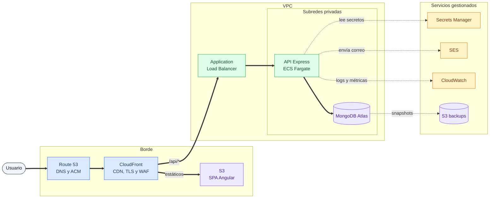

# Análisis técnico

Documento de análisis de la prueba técnica. Las secciones de AWS y migración son
propuestas escritas: no se desplegó infraestructura real.

Las mediciones citadas se obtuvieron ejecutando el proyecto en local contra
MongoDB 7 en Docker. Los comandos para reproducirlas están incluidos.

## Contenido

1. [Modelo de datos y rendimiento en MongoDB](#1-modelo-de-datos-y-rendimiento-en-mongodb)
2. [Diagnóstico del incidente de producción](#2-diagnóstico-del-incidente-de-producción)
3. [Arquitectura en AWS](#3-arquitectura-en-aws)
4. [Plan de migración](#4-plan-de-migración)
5. [Seguridad](#5-seguridad)
6. [Revisión crítica](#6-revisión-crítica)

---

## 1. Modelo de datos y rendimiento en MongoDB

### 1.1 Índices con 2 millones de documentos

Los índices actuales se crean por migración versionada, nunca con `autoIndex`
de Mongoose. Están en `backend/migrations/20260904000002-create-leads-indexes.js`:

| Índice                          | Propósito                               |
| ------------------------------- | --------------------------------------- |
| `{ status: 1, createdAt: -1 }`  | Filtro por estado + orden por fecha     |
| `{ source: 1, createdAt: -1 }`  | Filtro por fuente + orden por fecha     |
| `{ project: 1, createdAt: -1 }` | Filtro por proyecto + orden por fecha   |
| `{ createdAt: -1 }`             | Orden por fecha sin filtro previo       |
| `{ budget: -1 }`                | Orden por presupuesto sin filtro previo |
| `{ email: 1 }`                  | Búsqueda por correo                     |

**Los compuestos siguen el patrón ESR** (Equality, Sort, Range): primero el campo
por el que se filtra por igualdad, después el de ordenamiento. Ese orden permite
que MongoDB resuelva filtro y orden recorriendo un solo índice, sin una etapa
`SORT` en memoria. Invertir el orden de los campos obligaría a ordenar en
memoria, y con un conjunto grande el motor aborta la consulta al superar el
límite de 32 MB para ordenamientos sin índice.

**Qué añadiría al crecer a 2 millones:**

Con el volumen actual las consultas de la aplicación se resuelven con un solo
filtro. Si el uso real mostrara combinaciones frecuentes (por ejemplo estado y
proyecto a la vez), añadiría un compuesto de tres campos siguiendo el mismo
patrón, `{ project: 1, status: 1, createdAt: -1 }`, que además sirve para
consultas que solo filtren por `project` gracias al prefijo izquierdo del índice.

No añadiría un índice por campo "por si acaso": cada índice ocupa espacio,
penaliza cada escritura y compite por la caché del `WiredTiger`. La decisión
debe salir de las consultas reales, que es lo que mide el perfilador.

**Lo que decidiría con datos, no por intuición:** activar el profiler en
`slowms: 100` durante una semana de uso real y crear índices solo para los
patrones que aparezcan. Un índice que no usa ninguna consulta es coste puro.

### 1.2 Cómo identificar una consulta con problemas de rendimiento

Tres herramientas, en este orden:

**`explain("executionStats")`** sobre la consulta sospechosa. La señal clave es
la relación entre `totalDocsExamined` y `nReturned`: si el motor examina miles de
documentos para devolver diez, falta un índice. Y `stage: 'COLLSCAN'` indica que
no se usó ninguno.

Verificado en este proyecto sobre el filtro por estado:

```bash
docker exec rel-mongo mongosh real_estate_leads --quiet --eval \
 'db.leads.find({status:"Reservado"}).sort({createdAt:-1}).explain("executionStats").executionStats'
```

Con el índice `status_createdAt` el plan usa `IXSCAN` y examina solo los
documentos que coinciden.

**El profiler de base de datos** para descubrir consultas lentas que nadie
reportó:

```js
db.setProfilingLevel(1, { slowms: 100 });
db.system.profile.find().sort({ millis: -1 }).limit(10);
```

**Métricas de aplicación.** Cada respuesta de la API lleva un `x-request-id` que
aparece también en los logs estructurados de Pino, con `responseTime` por
petición. Eso permite correlacionar una petición lenta reportada por un usuario
con la consulta concreta que la causó.

### 1.3 Qué cambiaría si el dashboard empezara a tardar segundos

**Este es el punto más importante del análisis, y el diagnóstico ya está hecho.**

El endpoint `GET /api/dashboard/summary` resuelve los siete indicadores con un
único `$facet`. Su plan de ejecución, medido en local:

```bash
docker exec rel-mongo mongosh real_estate_leads --quiet --eval '
db.leads.explain("executionStats").aggregate([{$facet:{totals:[{$group:{_id:null,t:{$sum:1}}}]}}]).stages[0].$cursor.executionStats'
```

```
stage: 'COLLSCAN', nReturned: 10, totalDocsExamined: 10, executionTimeMillis: 0
```

**Ese `COLLSCAN` es correcto y no se puede evitar con índices.** Calcular un
total, un promedio y agrupaciones sobre _toda_ la colección obliga a leer todos
los documentos; no hay filtro que reduzca el conjunto. Con 10 registros son 0 ms;
con 2 millones son segundos.

**Aquí está el matiz que distingue el diagnóstico correcto: los índices resuelven
los filtros de la tabla, no el resumen del dashboard.** Confundir ambos problemas
lleva a añadir índices que no cambian nada.

Las soluciones reales, en orden de coste creciente:

**Caché con TTL corto.** Un resumen de negocio no necesita ser exacto al
segundo. Cachear la respuesta 60 segundos convierte N peticiones por minuto en
una sola agregación. Es lo primero que haría: una línea de código y resuelve el
caso de muchos usuarios mirando el mismo dashboard.

**Vista materializada con `$merge`.** Un job programado ejecuta la agregación y
escribe el resultado en una colección `dashboard_summary`; el endpoint pasa a ser
un `findOne`. El dashboard responde en milisegundos independientemente del
volumen. El coste es que los datos tienen la antigüedad del último job.

**Actualización incremental por evento.** Cada creación o cambio de estado
actualiza contadores con `$inc` sobre el documento de resumen. Es exacto y
constante en tiempo, pero introduce el riesgo de deriva si un contador se pierde,
así que necesita un recálculo completo periódico como red de seguridad.

**Acotar la ventana temporal.** Los indicadores rara vez necesitan toda la
historia. Limitar el agregado a los últimos 12 meses con un `$match` inicial
sobre `createdAt` permite que el índice `createdAt_desc` reduzca el conjunto
antes de agrupar, y convierte el `COLLSCAN` en `IXSCAN`.

Empezaría por la caché por ser reversible y de coste casi nulo, y mediría antes
de pasar a la vista materializada.

### 1.4 Documentos embebidos frente a referencias

**Embebería** cuando los datos se leen siempre junto al documento padre, no
crecen sin límite y pertenecen a él en exclusiva. En este dominio, el historial
de cambios de estado de un lead (fecha, estado anterior, estado nuevo, usuario)
iría embebido: se consulta al abrir el lead, nunca por sí solo, y su tamaño está
acotado por el número de transiciones posibles.

La ventaja es que una sola lectura trae todo, sin `$lookup`, y las escrituras son
atómicas a nivel de documento sin necesidad de transacciones.

**Referenciaría** cuando la entidad tiene vida propia, se consulta de forma
independiente, se comparte entre varios padres o crece sin cota. Los proyectos
inmobiliarios son el ejemplo claro: hoy están como texto en cada lead, pero en un
sistema real tendrían nombre, ubicación, unidades disponibles y precios. Duplicar
eso en cada lead obligaría a actualizar miles de documentos al renombrar un
proyecto.

**El límite duro que decide muchos casos:** un documento de MongoDB no puede
superar 16 MB. Cualquier arreglo embebido que crezca sin cota (notas, mensajes,
eventos) termina siendo un problema, y el patrón correcto es una colección aparte
con referencia.

**Mi criterio práctico:** empezar embebido si los datos se leen juntos, y
extraer a colección propia en cuanto aparezca alguna de estas señales: el arreglo
crece sin límite, la subentidad se consulta por sí sola, o se necesita
actualizarla sin reescribir el padre.

---

## 2. Diagnóstico del incidente de producción

**Escenario:** el dashboard, que cargaba de inmediato, ahora tarda entre 8 y 12
segundos tras varios meses en operación.

### 2.1 Cómo iniciaría la investigación

Antes de tocar una línea de código, recopilaría:

**Cuándo empezó y si fue gradual o repentino.** Una degradación progresiva apunta
a crecimiento de datos; una caída brusca apunta a un despliegue, un cambio de
configuración o un índice eliminado. La fecha del último despliegue frente a la
fecha de las primeras quejas separa ambas hipótesis en minutos.

**A quién afecta.** Todos los usuarios o algunos; todas las vistas o solo el
dashboard. Si la tabla de leads responde bien y solo el resumen es lento, el
problema está acotado a la agregación y no a la infraestructura.

**Qué cambió.** Volumen de la colección hoy frente a hace tres meses,
despliegues recientes, cambios de tamaño de instancia, migraciones aplicadas.

**Evidencia concreta:** un `x-request-id` de una petición lenta reportada por un
usuario. Con él se recupera la traza completa en los logs.

Documentaría todo esto antes de proponer una causa. La tentación de "ya sé lo que
es" antes de mirar los datos es el origen de la mayoría de las correcciones que
no arreglan nada.

### 2.2 Cómo determinaría dónde está el cuello de botella

Midiendo capa por capa, de fuera hacia dentro:

**¿Es el navegador o el servidor?** La pestaña de red del navegador da el TTFB de
la llamada a `/api/dashboard/summary`. Si el TTFB es de 8 segundos, el frontend
está descartado: Angular solo está esperando.

**¿Es la red o la API?** Comparar el tiempo desde el navegador con un `curl`
ejecutado dentro de la misma VPC. Si desde dentro también tarda 8 segundos, no es
latencia de red ni CDN.

**¿Es la API o la base de datos?** El `responseTime` que registra `pino-http` por
petición se compara con el tiempo de la consulta en el profiler de MongoDB. Si
casi todo el tiempo está en la consulta, la aplicación queda descartada.

**¿Es la consulta o la infraestructura?** `explain("executionStats")` sobre la
agregación, y métricas de CloudWatch de CPU, memoria, IOPS y conexiones. Un
`COLLSCAN` de 2 millones de documentos con CPU al 30% es un problema de consulta;
CPU al 100% con la misma consulta apunta a instancia infradimensionada.

Ese orden importa: cada paso descarta una capa completa, en lugar de investigar
todo a la vez.

### 2.3 Logs, métricas y herramientas

**Logs de aplicación:** Pino en formato JSON hacia CloudWatch Logs, con
`x-request-id` por petición. Permite `filter @message like /request-id/` y
reconstruir la traza completa de una petición concreta.

**Métricas de MongoDB:** profiler con `slowms`, `db.currentOp()` para consultas
en ejecución, y las métricas del proveedor: conexiones, ratio de aciertos de
caché y cola de lectura.

**Métricas de infraestructura:** CloudWatch para CPU, memoria, latencia del
balanceador y códigos de respuesta.

**Herramienta decisiva:** `explain("executionStats")`. Es la única que responde
_por qué_ una consulta es lenta, no solo _cuánto_ tarda.

En este proyecto ya está la instrumentación necesaria: el correlation ID, el
`responseTime` por petición, y el `customLogLevel` que clasifica 5xx como `error`
para poder alertar sobre ellos sin ruido de 404.

### 2.4 Cómo identificaría la causa raíz sin quedarme en el síntoma

**Reproduciéndola de forma controlada.** Cargar una copia de producción en un
entorno aislado y ejecutar la agregación aislada del resto del sistema. Si tarda
lo mismo sin usuarios concurrentes, la causa está en la consulta y no en la
concurrencia.

**Buscando la relación cuantitativa.** Si el tiempo crece de forma
aproximadamente lineal con el número de documentos, es un recorrido completo de
la colección. Si crece a saltos, apunta a agotamiento de memoria o de caché.

**Verificando la hipótesis antes de corregir.** Si la hipótesis es "el `$facet`
recorre toda la colección", se comprueba ejecutándolo con un `$match` que limite
a un mes: si baja a milisegundos, queda confirmada.

**La señal de que se está tratando el síntoma:** aumentar el tamaño de la
instancia y ver que mejora. Puede aliviar el dolor, pero si la causa es un
recorrido completo, el problema vuelve al crecer los datos y ahora cuesta más
dinero. Subir recursos es aceptable como medida temporal declarada, nunca como
solución.

En este caso concreto, la causa raíz ya está identificada y documentada en la
sección 1.3: el `COLLSCAN` inevitable del agregado sobre toda la colección.

### 2.5 Cómo validaría la mejora y prevendría la recurrencia

**Validación:**

Medir antes y después con la misma metodología: p50, p95 y p99 del endpoint, no
el promedio, porque un promedio esconde que el 5% de usuarios sigue esperando 10
segundos. Confirmar con `explain` que el plan cambió a `IXSCAN` o que la
consulta desapareció por la vista materializada. Y verificar que los valores del
dashboard siguen siendo correctos: una optimización que devuelve números
equivocados es peor que la lentitud.

**Prevención:**

Una **alarma de CloudWatch sobre la latencia p95** del endpoint, con umbral por
debajo del punto de dolor (por ejemplo 2 segundos) para enterarse antes que los
usuarios.

Una **alarma sobre el crecimiento de la colección**, porque la causa raíz es el
volumen: avisar al cruzar umbrales permite anticiparse.

Un **test de rendimiento en CI** con un volumen representativo que falle si la
agregación supera un tiempo límite. Convierte una regresión de rendimiento en un
build rojo en lugar de en una queja de usuario.

Y **revisar el profiler periódicamente**, no solo cuando algo se rompe.

### 2.6 Cómo lo comunicaría a personas no técnicas

Con estructura de impacto primero y jerga cero:

> **Qué pasa:** el panel de indicadores tarda unos 10 segundos en abrir. El resto
> del sistema funciona con normalidad y no hay riesgo para los datos.
>
> **A quién afecta:** al equipo comercial que consulta el panel varias veces al
> día. No afecta a la captura de leads ni a los clientes.
>
> **Por qué:** el panel calcula sus totales revisando todos los registros
> históricos cada vez que se abre. Cuando había pocos era instantáneo; ahora hay
> muchos y el cálculo se nota.
>
> **Qué vamos a hacer:** guardar los totales ya calculados y actualizarlos
> periódicamente, en lugar de recalcularlos en cada visita. El panel volverá a
> abrir de inmediato y los datos tendrán como máximo unos minutos de antigüedad.
>
> **Cuándo:** una mejora parcial hoy mismo; la solución completa esta semana.
>
> **Próxima actualización:** mañana a primera hora.

Los tres elementos que no pueden faltar: **impacto en el negocio**, **qué se está
haciendo** y **cuándo habrá noticias**. Explicar el `COLLSCAN` no aporta nada a
quien necesita decidir si avisa a los usuarios.

---

## 3. Arquitectura en AWS

### 3.1 Diagrama



**Cómo leer el diagrama.** Las flechas gruesas siguen el camino de una petición de
usuario; las punteadas son dependencias de soporte que no están en ese camino.
El color agrupa por naturaleza: azul el borde público, verde el cómputo, morado
el almacenamiento y ámbar los servicios gestionados.

**Decisión de fondo:** CloudFront sirve tanto los estáticos como `/api/*`, con un
comportamiento distinto por ruta. Así la SPA y la API comparten dominio, lo que
elimina el CORS por completo y permite que el frontend use rutas relativas, que
es exactamente lo que hace `environment.production.ts` con `apiUrl: '/api'`.

### 3.2 Justificación servicio por servicio

**S3 y CloudFront para el frontend: sí.**

La salida de `ng build` son archivos estáticos con hash en el nombre. Servirlos
desde un contenedor sería pagar cómputo por entregar ficheros. S3 cuesta
céntimos, CloudFront los acerca al usuario y aporta TLS gratuito con ACM, y
permite asociar WAF en el borde para filtrar tráfico antes de que llegue a la
aplicación.

El detalle que hay que resolver: una SPA con enrutado por historial necesita que
cualquier ruta desconocida devuelva `index.html`. En CloudFront se configura con
una respuesta de error personalizada que mapea 403 y 404 a `/index.html` con
código 200. Sin eso, recargar la página en `/leads` da un 404.

Y una regla de caché diferenciada: los archivos con hash pueden cachearse un año;
`index.html` **nunca**, o los usuarios seguirán cargando la versión anterior tras
cada despliegue.

**Backend: contenedores sobre ECS Fargate sí, Lambda no en este caso.**

La API es un proceso Express de larga vida con un pool de conexiones a MongoDB.
Ese pool es justamente lo que encaja mal con Lambda: cada invocación en frío abre
conexiones nuevas, y con concurrencia alta se agota el límite de conexiones de la
base. Existen mitigaciones (RDS Proxy no aplica a MongoDB, y reutilizar la
conexión entre invocaciones es frágil), pero son parches sobre un desajuste de
modelo.

**Fargate** ejecuta la misma imagen Docker que ya existe en el repositorio, sin
servidores que administrar, con escalado por métricas y despliegues sin
interrupción. Arrancaría con dos tareas en zonas de disponibilidad distintas,
que es el mínimo para sobrevivir a la caída de una zona, y escalaría por uso de
CPU. El `Dockerfile` multi-etapa con usuario no-root ya está listo para esto.

**Elastic Beanstalk** funcionaría y es más sencillo de arrancar, pero abstrae la
infraestructura de un modo que complica los ajustes finos, y su modelo de
despliegue es más lento. Lo elegiría si el equipo no tuviera experiencia con
contenedores; no es el caso aquí, porque el proyecto ya está containerizado.

**Cuándo sí usaría Lambda:** para tareas puntuales y desacopladas, como el job
programado que recalcula la vista materializada del dashboard, o el envío de
correos en respuesta a un evento. Trabajo episódico, sin conexiones persistentes.

**SES para correo transaccional: sí.**

Notificaciones de nuevo lead o de cambio de estado. Es barato, se integra con IAM
sin credenciales SMTP en el código, y da métricas de entrega y rebote.

**Las dos cosas que no se pueden pasar por alto:** una cuenta nueva de SES está
en _sandbox_ y solo envía a direcciones verificadas (salir requiere una solicitud
que tarda), y hay que configurar SPF, DKIM y DMARC en el DNS o los correos irán a
spam. Ambas cosas se hacen **antes** de la migración, no el día del cambio.

**IAM y gestión de secretos: sí, y es donde más se equivoca la gente.**

Roles de IAM por servicio con permisos mínimos: la tarea de ECS solo puede leer
los secretos de la aplicación y escribir en sus logs; nada más. **Sin claves de
acceso en variables de entorno**: el rol de la tarea provee credenciales
temporales rotadas automáticamente.

Los secretos (cadena de conexión, `JWT_SECRET`) en **Secrets Manager**, con
rotación automática. La aplicación ya está preparada: `config/env.ts` lee todo de
`process.env` y valida al arrancar, así que solo cambia de dónde se inyectan.

**Cuentas separadas** para producción y no producción bajo AWS Organizations. Es
la única barrera que impide de verdad que una prueba borre datos reales.

**CloudWatch: sí, con alarmas concretas.**

Logs de Pino en JSON hacia CloudWatch Logs, ya estructurados y con los campos
sensibles redactados. Las alarmas que dejaría configuradas están en la sección
6.4.

**Backups de MongoDB: sí, y probados.**

Con **Atlas**: snapshots continuos con recuperación a un punto en el tiempo. Con
**DocumentDB**: snapshots automáticos con retención configurable.

**El punto que suele fallar:** un backup que nunca se ha restaurado no es un
backup. Programaría una restauración de prueba trimestral a un entorno aislado,
midiendo cuánto tarda (eso da el RTO real, no el estimado) y verificando que los
datos llegan íntegros.

**Atlas frente a DocumentDB:** elegiría Atlas. DocumentDB emula la API de MongoDB
pero no la implementa por completo, y aunque este proyecto no usa nada exótico,
descubrir una incompatibilidad después de migrar es un riesgo evitable. Atlas
corre MongoDB de verdad, se despliega dentro de la misma región con VPC peering y
ofrece recuperación a punto en el tiempo. DocumentDB tiene sentido si la política
de la empresa exige que todo sea servicio nativo de AWS.

---

## 4. Plan de migración

**Contexto:** trasladar frontend, backend, base de datos, archivos, dominio,
correo transaccional, variables y credenciales desde cuentas de terceros a
cuentas corporativas, minimizando indisponibilidad y pérdida de datos.

### 4.1 Antes: inventario y preparación

Nada se migra hasta que exista un inventario cerrado. Lo que documentaría:

| Ámbito          | Qué inventariar                                                           |
| --------------- | ------------------------------------------------------------------------- |
| Código          | Repositorios, ramas activas, quién tiene acceso, secretos en el historial |
| Infraestructura | Servicios en uso, dimensionamiento, coste mensual actual                  |
| Base de datos   | Versión, tamaño, colecciones, índices, tasa de escritura                  |
| Dominio         | Registrador, DNS, TTL actual, certificados y su vencimiento               |
| Correo          | Proveedor, dominios verificados, registros SPF/DKIM/DMARC                 |
| Variables       | Todas las de entorno por servicio, marcando cuáles son secretos           |
| Integraciones   | Servicios externos, webhooks entrantes, IPs en listas blancas             |
| Accesos         | Quién tiene acceso a qué, con nombre y responsable                        |

**Preparación en paralelo:**

Levantar la infraestructura nueva con **infraestructura como código** (Terraform
o CDK). Migrar a mano garantiza que el entorno no sea reproducible y que nadie
recuerde por qué algo está configurado así.

Verificar el dominio en SES y **sacarlo del sandbox** con antelación: es el
trámite con plazo menos controlable de toda la migración.

Poblar Secrets Manager y **generar credenciales nuevas**. La migración es la
oportunidad natural para rotar todo: las credenciales que conocía el proveedor
anterior deben dejar de ser válidas.

**Bajar el TTL del DNS a 60 segundos con al menos 48 horas de antelación.** Es el
paso más olvidado y el que decide si un rollback tarda un minuto o dos horas. El
TTL antiguo sigue cacheado hasta que expira, así que reducirlo el mismo día no
sirve de nada.

Preparar un **entorno de prueba idéntico** con una copia de los datos y ejecutar
ahí el ensayo completo, cronometrado. La ventana real solo puede estimarse
midiendo el ensayo.

### 4.2 Durante: la ventana de cambio

Ventana en horario de mínimo uso, comunicada con antelación.

1. **Congelar escrituras** o poner la aplicación en modo solo lectura. Sin esto,
   los datos escritos durante la copia se pierden.
2. **Copia final incremental** de la base de datos. La copia completa se hizo
   antes; ahora solo viaja el delta, que es lo que acota la ventana.
3. **Verificar integridad** con criterios objetivos: conteo de documentos por
   colección, y comparación de los indicadores agregados entre origen y destino.
   Si los números no cuadran exactamente, se aborta.
4. **Aplicar las migraciones de índices** (`npm run migrate:up`) y confirmar que
   se crearon todos. Sin índices, la aplicación arranca pero va lenta y parecerá
   un problema de la migración.
5. **Desplegar backend y frontend** en la infraestructura nueva.
6. **Validar sin cambiar el DNS**, usando el dominio interno del balanceador:
   `/api/health` en verde, login funcional, dashboard con los valores correctos,
   creación de un lead de prueba.
7. **Cambiar el DNS.** Con TTL en 60 segundos, la propagación es cuestión de
   minutos.
8. **Monitorizar activamente** durante la primera hora: tasa de errores 5xx,
   latencia p95, conexiones a la base, logs de error.

### 4.3 Después: verificación y cierre

**Primeras horas:** validar los flujos completos con usuarios reales, comprobar
que los correos llegan a bandeja de entrada y no a spam, y contrastar los
indicadores del dashboard con los valores previos a la migración.

**Primeros días:** comparar latencia y tasa de errores con la línea base
anterior, verificar que los backups automáticos se están generando, y **restaurar
uno a un entorno aislado** para confirmar que funcionan.

**Cierre:** actualizar la documentación con la arquitectura real, y **revocar de
forma ordenada los accesos anteriores**, pero no antes de tiempo. Mantendría el
entorno antiguo en solo lectura entre dos y cuatro semanas antes de darlo de
baja: es el seguro contra el problema que aparece a los diez días.

### 4.4 Rollback

**Criterios de aborto, decididos antes y no durante:**

| Señal            | Umbral                                               |
| ---------------- | ---------------------------------------------------- |
| Errores 5xx      | > 1% de las peticiones durante 5 minutos             |
| Latencia p95     | > 3 veces la línea base                              |
| Pérdida de datos | Cualquier discrepancia en los conteos                |
| Autenticación    | Los usuarios no pueden iniciar sesión                |
| Ventana          | Se supera el tiempo previsto sin validación completa |

Definirlos por adelantado evita la decisión más costosa de toda migración: seguir
adelante "porque ya llevamos mucho" cuando las señales dicen que hay que volver.

**Procedimiento:**

Devolver el DNS al destino anterior (inmediato gracias al TTL bajo), reactivar
las escrituras en el entorno original, y **sincronizar los datos escritos en el
entorno nuevo durante la ventana**. Este último paso es el que suele faltar en
los planes de rollback y el que causa pérdida de información.

Si el rollback ocurre después de horas con escrituras en producción nueva, deja
de ser un rollback y pasa a ser una migración inversa, con su propio plan. Por
eso la decisión de abortar debe tomarse **dentro de la ventana**, no al día
siguiente.

**Comunicación:** un aviso preparado de antemano para los usuarios, y una persona
designada como responsable de comunicar. Improvisar el mensaje mientras se
ejecuta el rollback garantiza que la comunicación llegue tarde y mal.

---

## 5. Seguridad

### 5.1 Resumen de controles

| #   | Control                                                         | OWASP      | Estado          |
| --- | --------------------------------------------------------------- | ---------- | --------------- |
| 1   | Autenticación JWT en rutas de escritura                         | A01 · API1 | Implementado    |
| 2   | Contraseñas con bcrypt y secretos por entorno                   | A02        | Implementado    |
| 3   | Validación estricta contra inyección y mass assignment          | A03 · API3 | Implementado    |
| 4   | Limitación de peticiones, con umbral estricto en el login       | A04 · API4 | Implementado    |
| 5   | Cabeceras de seguridad, CORS por lista blanca, límite de cuerpo | A05        | Implementado    |
| 6   | Registro seguro con redacción y correlación                     | A09        | Implementado    |
| 7   | Tope de tamaño de página                                        | API4       | Implementado    |
| 8   | Contenedor sin privilegios y auditoría de dependencias          | A05 · A06  | Implementado    |
| 9   | Token en cookie httpOnly con protección CSRF                    | A07        | Propuesto       |
| 10  | Framework fuera de soporte con CVEs conocidos                   | A06        | Riesgo aceptado |

### 5.2 Detalle

**1. Autenticación en las rutas de escritura**

> **Riesgo:** cualquiera puede crear leads o alterar su estado comercial,
> corrompiendo los datos sobre los que se toman decisiones de venta.
> **Medida:** `POST /api/leads` y `PATCH /api/leads/:id/status` exigen un token
> Bearer emitido en `/api/auth/login`. Las lecturas permanecen públicas.
> **Resultado:** las escrituras quedan restringidas a usuarios autenticados y
> cada operación es atribuible al `sub` del token.

**2. Contraseñas y secretos**

> **Riesgo:** una filtración de la base expone credenciales reutilizables en
> otros servicios.
> **Medida:** bcrypt con coste 12. El campo tiene `select: false`, se elimina en
> `toJSON`, y el validador de MongoDB exige una longitud de entre 55 y 72
> caracteres, que es la de un hash bcrypt.
> **Resultado:** es imposible almacenar una contraseña en texto plano, incluso
> por error de programación. Verificado: `db.users.insertOne` con una contraseña
> corta es rechazado por el motor.

**3. Validación estricta**

> **Riesgo:** inyección de operadores de MongoDB (`{"email": {"$gt": ""}}`
> permite saltarse el login) y asignación masiva de campos no previstos.
> **Medida:** esquemas Zod con `.strict()` en el borde de la API, un middleware
> propio que elimina claves con `$` o `.`, y validadores `$jsonSchema` a nivel
> del motor.
> **Resultado:** los operadores se rechazan antes de llegar a la consulta, y un
> campo extra como `"role": "admin"` produce un 400 en lugar de colarse al
> documento. Ambos casos están cubiertos por tests.

**4. Limitación de peticiones**

> **Riesgo:** fuerza bruta contra el login y agotamiento de recursos.
> **Medida:** límite global configurable, y uno específico y más estricto en
> `/auth/login` que solo cuenta intentos fallidos.
> **Resultado:** un ataque de fuerza bruta queda acotado a unos pocos intentos
> por ventana, sin penalizar a quien se equivoca una vez y luego acierta.

**5. Configuración de seguridad**

> **Riesgo:** exposición de tecnología del servidor, XSS por falta de cabeceras,
> acceso desde orígenes no autorizados, agotamiento de memoria por cuerpos
> grandes.
> **Medida:** Helmet con CSP explícita, CORS por lista blanca más el origen
> propio, `x-powered-by` desactivado, límite de 100 KB por cuerpo, y trazas de
> pila ocultas fuera de desarrollo.
> **Resultado:** verificado con tests que un origen ajeno recibe 403, que un
> origen malformado no provoca un 500, y que las cabeceras se aplican.

**6. Registro seguro**

> **Riesgo:** contraseñas y tokens escritos en los logs, e imposibilidad de
> correlacionar un incidente reportado con lo ocurrido en el servidor.
> **Medida:** Pino con `redact` sobre `authorization`, `cookie`, `password` y
> `token`, y un `x-request-id` por petición presente en la respuesta y en cada
> línea de log.
> **Resultado:** los campos sensibles aparecen como `[REDACTED]`, y un usuario
> que reporta un error puede aportar el identificador que lleva directo a la
> traza.

**7. Tope de tamaño de página**

> **Riesgo:** `?limit=999999` obliga a serializar la colección completa y agota
> memoria y ancho de banda.
> **Medida:** el esquema Zod limita `limit` a 100 y rechaza valores superiores.
> **Resultado:** el consumo por petición queda acotado con independencia de lo
> que envíe el cliente.

**8. Contenedor y dependencias**

> **Riesgo:** una vulnerabilidad de ejecución remota se agrava si el proceso
> corre como root, y las dependencias acumulan CVEs con el tiempo.
> **Medida:** imagen multi-etapa que ejecuta como usuario `node`, con
> `dumb-init` para el manejo de señales, y `npm audit --audit-level=high` en el
> pipeline de integración.
> **Resultado:** el backend no tiene vulnerabilidades conocidas, y una nueva
> rompe el build antes de llegar a producción.

**9. Token en cookie httpOnly: propuesto, no implementado**

> **Riesgo:** el token se devuelve en el cuerpo y el frontend lo guarda en
> `localStorage`, accesible desde JavaScript; un XSS permitiría robarlo.
> **Medida:** emitirlo en una cookie `httpOnly` + `Secure` + `SameSite=Strict`,
> añadiendo protección CSRF.
> **Resultado esperado:** el token deja de ser accesible desde JavaScript, de
> modo que un XSS no puede exfiltrarlo.
> **Por qué no se implementó:** el flujo Bearer es el estándar esperado en una
> SPA con API REST, y añadir cookies obliga a gestionar CSRF y complica los
> clientes que no son navegador. Es alcance que el ejercicio no pide, pero el
> riesgo debe quedar declarado.

**10. Angular 16 fuera de soporte: riesgo aceptado**

El ejercicio fija Angular 16, cuyo ciclo de soporte terminó. `npm audit` reporta
**55 vulnerabilidades en total y 10 de severidad alta en dependencias de
producción**, todas con raíz en `@angular/core`, `@angular/common` y
`@angular/compiler`. No se pueden corregir: el único arreglo disponible es
actualizar a una versión mayor, lo que incumpliría el requisito.

Revisando su aplicabilidad real a esta aplicación:

| Aviso                                                 | ¿Aplica aquí?                                                                                |
| ----------------------------------------------------- | -------------------------------------------------------------------------------------------- |
| XSS vía i18n (3 avisos)                               | No (la aplicación no usa i18n                                                                |
| `HttpTransferCache` y hidratación (4 avisos)          | No) son de SSR; esta es una SPA pura                                                         |
| Fuga de token XSRF por URLs relativas de protocolo    | No (`apiUrl` es absoluta en desarrollo y `/api` en producción, nunca `//host`                |
| Denegación de servicio en `formatDate` y `digitsInfo` | No) los formatos son literales fijos, no provienen del usuario                               |
| Bypass de saneado en SVG y MathML                     | Exposición baja: requiere HTML no confiable; no se usa `innerHTML` ni `bypassSecurityTrust*` |

> **Riesgo:** framework sin soporte con vulnerabilidades publicadas.
> **Medida:** actualizar a una versión con soporte activo. Mientras la
> restricción exista, mitigación por diseño: sin `innerHTML`, sin
> `bypassSecurityTrust*`, sin i18n y sin SSR, apoyándose en el escapado por
> defecto de las plantillas.
> **Resultado:** de los diez avisos, ninguno resulta explotable en esta
> aplicación tal como está construida, con la ruta de actualización identificada.

El pipeline **no ejecuta `npm audit` sobre el frontend**, y es deliberado: un
check que siempre falla por algo que no se puede arreglar entrena al equipo a
ignorar los checks.

### 5.3 Hoja de ruta de seguridad

Los controles de 5.2 son los que exige un módulo de este alcance. Si el proyecto
creciera a producción con usuarios reales, estos son los siguientes, ordenados
por lo que aporta cada uno frente a lo que cuesta.

#### Antes de exponerlo a usuarios reales

| Control                                                | OWASP | Por qué                                            |
| ------------------------------------------------------ | ----- | -------------------------------------------------- |
| Access token y refresh token con expiración deslizante | A07   | Cierre de sesión por inactividad real              |
| Limitación de peticiones con almacén compartido        | A04   | El contador en memoria se multiplica por instancia |
| Bloqueo temporal de cuenta tras varios fallos          | A07   | Complementa la limitación por IP                   |
| TLS obligatorio con HSTS                               | A02   | Impide la degradación a HTTP                       |
| Rotación automática de secretos                        | A02   | Acota la ventana de una credencial filtrada        |
| Política de retención de datos personales              | Datos | Los leads contienen nombre, correo y teléfono      |

#### Al crecer el equipo o el volumen

| Control                                     | OWASP | Por qué                                              |
| ------------------------------------------- | ----- | ---------------------------------------------------- |
| Roles y permisos granulares                 | A01   | Hoy `admin` y `agent` existen pero no se diferencian |
| Registro de auditoría solo de anexado       | A09   | Trazabilidad de quién cambió qué y cuándo            |
| Segundo factor para cuentas administrativas | A07   | La contraseña deja de ser el único obstáculo         |
| Actualización automatizada de dependencias  | A06   | Evita acumular CVEs en silencio                      |
| Análisis dinámico en el pipeline            | A05   | Complementa el análisis estático de SonarCloud       |

### 5.4 Detalle de los tres más relevantes

**Cierre de sesión por inactividad con access token y refresh token**

Hoy el token dura una hora fija y no existe el concepto de inactividad: un token
emitido sigue siendo válido aunque el usuario cierre el navegador, porque JWT es
sin estado por diseño y el servidor no puede invalidarlo.

El esquema correcto usa dos tokens con roles distintos. El **access token** dura
poco, entre 5 y 15 minutos, y viaja en cada petición. El **refresh token** dura
más, por ejemplo 8 horas, se guarda en una cookie `httpOnly` y solo sirve para
pedir un access token nuevo.

La inactividad se materializa así: cada renovación extiende la ventana, pero si
el usuario deja de actuar, el access token caduca en minutos y el refresh
termina por expirar sin renovarse. Eso es un cierre por inactividad real, no una
caducidad fija.

Dos piezas lo hacen seguro. La **rotación**: cada uso del refresh token emite uno
nuevo e invalida el anterior. Y la **detección de reutilización**: si aparece un
refresh token ya consumido, significa que alguien lo robó, y la respuesta es
invalidar toda la familia de tokens de ese usuario y forzar un nuevo login.

El coste es que el refresh token sí necesita estado en servidor, una tabla de
tokens vigentes por usuario. Ahí se pierde parte de la ventaja de JWT, y es la
razón por la que no entró en el alcance de la prueba.

**Limitación de peticiones con almacén compartido**

La limitación actual vive en la memoria del proceso. Con una sola instancia
funciona; con tres instancias detrás de un balanceador, cada una lleva su propio
contador y el límite efectivo se triplica sin que nadie lo note.

La solución es mover el contador a Redis con `rate-limit-redis`, de modo que las
instancias compartan estado. Es un cambio de una línea en la configuración del
middleware más una dependencia de infraestructura, y convierte un control que
hoy es aproximado en uno exacto.

**Retención y minimización de datos personales**

Es el control que el enunciado nombra y el que más se olvida. La colección de
leads guarda nombre, correo y teléfono de personas físicas, así que le aplican
las obligaciones de protección de datos con independencia de que sea un CRM
interno.

Lo que implementaría, en orden:

**Minimización**: no almacenar lo que no se usa. El teléfono es opcional en el
modelo, y esa decisión debería ser consciente y no accidental.

**Retención con caducidad**: un lead descartado hace tres años no aporta valor
comercial y sí riesgo. Un índice TTL de MongoDB sobre los descartados, o un job
de anonimización que conserve las métricas agregadas pero borre los datos
identificativos, resuelve las dos cosas a la vez.

**Derecho de supresión**: un procedimiento para borrar los datos de una persona
cuando lo solicite, incluyendo copias en backups. Este último punto es el que
suele quedar sin resolver y conviene decidirlo antes de tener backups de años.

**Cifrado en reposo** con claves gestionadas, y **registro de acceso** a datos
personales para saber quién consultó qué.

---

## 6. Revisión crítica

### 6.1 ¿Cuál es el principal riesgo técnico de la solución entregada?

**El endpoint del dashboard no escala**, y es un riesgo conocido y medido, no una
sorpresa.

`GET /api/dashboard/summary` recorre la colección completa en cada petición. Con
los 10 registros del Anexo A responde en 0 ms; con volumen real de producción se
convierte exactamente en el incidente descrito en la sección 2. Es el mismo
problema que el ejercicio plantea como escenario hipotético, y está presente en
el código entregado por diseño: resolverlo requiere pre-agregación, que es
infraestructura y alcance que la prueba no pide.

Lo señalo como riesgo principal precisamente porque **está identificado, medido
con `explain()` y con solución documentada**. Un riesgo conocido se gestiona; el
peligroso es el que nadie ha buscado.

Como riesgo secundario, la limitación de peticiones vive en memoria del proceso:
con varias instancias detrás de un balanceador, cada una lleva su propio contador
y el límite efectivo se multiplica por el número de instancias. En producción
haría falta un almacén compartido con Redis.

### 6.2 ¿Qué refactorizaría primero con un día adicional?

**Extraer la gestión de estado del componente del dashboard a un servicio
dedicado.**

Hoy `LeadsDashboardComponent` conoce demasiado: mantiene el `BehaviorSubject` de
la consulta, orquesta los diálogos, gestiona los errores de acción y compone los
observables. Funciona y está probado, pero es el archivo que más crecería al
añadir funciones (edición de leads, exportación, filtros guardados) y el que
antes se volvería difícil de seguir.

Un `LeadsStore` con el estado y los métodos de transición dejaría al componente
como una capa de presentación delgada, y permitiría probar la lógica de estado
sin montar el componente.

**Lo que no refactorizaría:** el backend. La separación por módulos con
controlador, servicio y esquema está clara y cada pieza tiene una
responsabilidad. Refactorizar lo que ya funciona y está probado, solo por
gusto estético, es gastar el día en lo que menos rinde.

### 6.3 ¿Qué decisión tomó por el límite de tiempo y cuál sería la alternativa ideal?

**El dashboard calcula en cada petición en lugar de leer una vista
materializada.**

Lo ideal sería una colección `dashboard_summary` mantenida por un job programado
con `$merge`, dejando el endpoint como un `findOne`. Es la diferencia entre un
endpoint cuyo coste crece con los datos y uno de coste constante.

No se implementó porque requiere un planificador, una estrategia de invalidación
y decidir la frescura aceptable de los datos (preguntas de negocio, no
técnicas). Con el volumen del ejercicio, la agregación directa es la solución
correcta y más simple; con volumen real, deja de serlo.

Hay dos decisiones menores de la misma naturaleza: **paginación por `skip`**, que
degrada en páginas muy altas y que en producción convertiría a paginación por
cursor sobre `createdAt`; y **el ordenamiento del listado limitado a dos campos**,
que es lo que pide el enunciado, pero que en un sistema real querría ser
extensible sin tocar el esquema de validación.

### 6.4 ¿Qué monitoreo y alertas dejaría para la primera semana en producción?

Pocas alarmas y accionables. Una alarma que salta a diario y nadie atiende es
peor que no tenerla.

| Alarma                  | Umbral                     | Por qué                                                                |
| ----------------------- | -------------------------- | ---------------------------------------------------------------------- |
| Tasa de errores 5xx     | > 1% en 5 minutos          | Fallo real del servidor, distinto de errores de validación del cliente |
| Latencia p95 de la API  | > 2 segundos en 10 minutos | Detecta la degradación antes que los usuarios                          |
| `/api/health` degradado | 2 comprobaciones seguidas  | La base de datos dejó de responder                                     |
| Conexiones a MongoDB    | > 80% del límite           | Anticipa el agotamiento del pool                                       |
| Fallos de login         | Pico anómalo en 15 minutos | Posible ataque de credenciales                                         |
| Backup no generado      | Ausencia en 24 horas       | El fallo silencioso más caro que existe                                |

**Además de las alarmas:**

Un **panel** con peticiones por minuto, latencia por endpoint, tasa de errores y
tamaño de la colección. Ese último número es el que anticipa la degradación del
dashboard.

**Revisión diaria de los logs de error** durante la primera semana, no solo
cuando salte una alarma. Los problemas iniciales suelen manifestarse como errores
esporádicos que no cruzan ningún umbral.

**Una línea base registrada por escrito** al final de la primera semana:
latencia, volumen y tasa de errores. Sin ella, dentro de tres meses nadie podrá
responder si el sistema está más lento o si siempre fue así, que es exactamente
la información que faltaría para diagnosticar el incidente de la sección 2.

---

## Apéndice: cómo reproducir las mediciones

```bash
# Plan de ejecución del agregado del dashboard (COLLSCAN esperado)
docker exec rel-mongo mongosh real_estate_leads --quiet --eval '
db.leads.explain("executionStats")
 .aggregate([{$facet:{totals:[{$group:{_id:null,t:{$sum:1}}}]}}])
 .stages[0].$cursor.executionStats'

# Plan de una consulta filtrada (IXSCAN esperado)
docker exec rel-mongo mongosh real_estate_leads --quiet --eval '
db.leads.find({status:"Reservado"}).sort({createdAt:-1})
 .explain("executionStats").executionStats'

# Índices existentes, creados por migración
docker exec rel-mongo mongosh real_estate_leads --quiet --eval \
 'db.leads.getIndexes().map(i => i.name)'

# El validador del motor rechaza datos inválidos aunque se salte la API
docker exec rel-mongo mongosh real_estate_leads --quiet --eval '
db.leads.insertOne({name:"X",email:"x@x.com",source:"TikTok",status:"Vendido",
 budget:-5,project:"P",createdAt:new Date(),updatedAt:new Date()})'

# Vulnerabilidades que realmente llegan a producción en el frontend
cd frontend && npm audit --omit=dev
```
